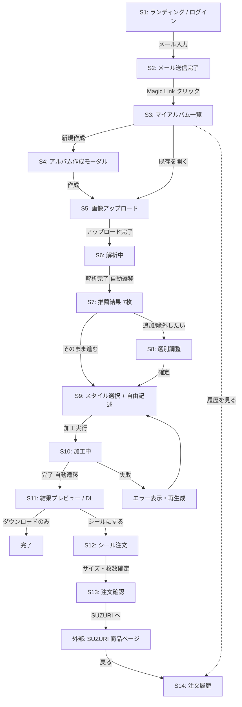

# 画面遷移ドキュメント

## 1. 画面一覧

| ID | 画面名 | ルート | 認証 |
|---|---|---|---|
| S1 | ランディング / ログイン | `/` | 不要 |
| S2 | メール送信完了 | `/auth/check-email` | 不要 |
| S3 | マイアルバム一覧 | `/albums` | 必要 |
| S4 | アルバム新規作成（モーダル） | `/albums?new=1` | 必要 |
| S5 | 画像アップロード | `/albums/[id]/upload` | 必要 |
| S6 | 解析中（進捗表示） | `/albums/[id]/analyzing` | 必要 |
| S7 | 推薦結果（7枚） | `/albums/[id]/recommend` | 必要 |
| S8 | 選別調整（追加/除外） | `/albums/[id]/select` | 必要 |
| S9 | スタイル選択 + 自由記述 | `/albums/[id]/style` | 必要 |
| S10 | 加工中 | `/albums/[id]/transforming` | 必要 |
| S11 | 結果プレビュー / DL | `/albums/[id]/result` | 必要 |
| S12 | シール注文（サイズ・枚数） | `/albums/[id]/order` | 必要 |
| S13 | 注文確認 → SUZURI 遷移 | `/albums/[id]/order/confirm` | 必要 |
| S14 | 注文履歴 | `/orders` | 必要 |
| L1 | 利用規約 | `/legal/terms` | 不要 |
| L2 | プライバシーポリシー | `/legal/privacy` | 不要 |
| L3 | 特定商取引法表記 | `/legal/tokushoho` | 不要 |

## 2. 遷移フロー図



## 3. ワイヤーフレーム（主要画面）

### S1: ランディング / ログイン
```
┌─────────────────────────────────────────────────┐
│  [Logo]  Travel Album Art            利用規約 ▾ │
├─────────────────────────────────────────────────┤
│      旅行写真を、アートのシールに。            │
│      AIが選別 → スタイル加工 → スーツケースへ   │
│                                                 │
│      [ メールアドレス               ]           │
│      [ ログインリンクを送る ]                   │
│      ※ AI学習には利用しません                  │
└─────────────────────────────────────────────────┘
```

### S3: マイアルバム一覧
```
┌─────────────────────────────────────────────────┐
│  [Logo]   アルバム  注文履歴      user@... ▾  │
├─────────────────────────────────────────────────┤
│  マイアルバム                  [ + 新規作成 ]   │
│  ┌──────────┐ ┌──────────┐ ┌──────────┐        │
│  │ 京都 春旅 │ │ 北海道   │ │ Hawaii   │        │
│  │ 87枚     │ │ 32枚     │ │ 15枚 加工中│      │
│  └──────────┘ └──────────┘ └──────────┘        │
└─────────────────────────────────────────────────┘
```

### S5: 画像アップロード
```
┌─────────────────────────────────────────────────┐
│  ← 京都 春旅                     ステップ 1/5  │
├─────────────────────────────────────────────────┤
│  画像をアップロード（最大100枚・画像のみ）      │
│  ┌─────────────────────────────────────────┐    │
│  │      ⬆  ここにドラッグ&ドロップ         │    │
│  │         または [ファイルを選択]         │    │
│  └─────────────────────────────────────────┘    │
│  □ 被写体本人/保護者の同意を得ています          │
│  □ 顔画像をAI解析に使うことに同意します         │
│                          [ 解析を開始 → ]       │
└─────────────────────────────────────────────────┘
```

### S7: 推薦結果（7枚）
```
┌─────────────────────────────────────────────────┐
│  ← 京都 春旅                     ステップ 3/5  │
├─────────────────────────────────────────────────┤
│  AIのおすすめ7枚              [ ✎ 選び直す ]    │
│  顔がはっきり写っている写真を選びました         │
│  ┌────┐ ┌────┐ ┌────┐ ┌────┐                  │
│  │ ✓  │ │ ✓  │ │ ✓  │ │ ✓  │                  │
│  └────┘ └────┘ └────┘ └────┘                  │
│  ┌────┐ ┌────┐ ┌────┐                          │
│  │ ✓  │ │ ✓  │ │ ✓  │                          │
│  └────┘ └────┘ └────┘                          │
│          [ この7枚で進む → ]                   │
└─────────────────────────────────────────────────┘
```

### S9: スタイル選択 + 自由記述
```
┌─────────────────────────────────────────────────┐
│  ← 京都 春旅                     ステップ 4/5  │
├─────────────────────────────────────────────────┤
│  どのスタイルに加工しますか？                   │
│  ┌─────┐ ┌─────┐ ┌─────┐ ┌─────┐                │
│  │アニメ│ │水彩 │ │油絵 │ │ﾋﾟｸｾﾙ│                │
│  │  ●  │ │     │ │     │ │     │                │
│  └─────┘ └─────┘ └─────┘ └─────┘                │
│                                                 │
│  追加の要望（自由記述・任意）                   │
│  [ 例) 表情をもっと明るく、肌をきれいに    ]    │
│                                                 │
│  対象: 7枚 × 1スタイル                          │
│          [ 加工を開始 → ]                       │
└─────────────────────────────────────────────────┘
```

### S11: 結果プレビュー / DL
```
┌─────────────────────────────────────────────────┐
│  ← 京都 春旅                                   │
├─────────────────────────────────────────────────┤
│  加工完了！                                     │
│  ┌────┐ ┌────┐ ┌────┐ ┌────┐                  │
│  │Before│ │Before│ │Before│ │Before│            │
│  │After │ │After │ │After │ │After │            │
│  │[⬇][↻]│ │[⬇][↻]│ │[⬇][↻]│ │[⬇][↻]│        │
│  └────┘ └────┘ └────┘ └────┘                  │
│  [ 全部まとめてZIPで保存 ]                      │
│                                                 │
│  シールにして送ってもらう                       │
│              [ シールを注文する → ]             │
└─────────────────────────────────────────────────┘
```

### S12: シール注文
```
┌─────────────────────────────────────────────────┐
│  ← 結果に戻る                                  │
├─────────────────────────────────────────────────┤
│  シール仕様                                     │
│  サイズ        ◉ 7×7cm（おすすめ・スーツケース）│
│                ○ 5×5cm                          │
│                ○ 10×10cm                        │
│                ○ カスタム  [  ]×[  ] cm         │
│                                                 │
│  対象画像（7枚）                                │
│  各画像の枚数: [- 1 +]                          │
│  小計: ¥2,400 + 送料 ¥250 = ¥2,650              │
│              [ 注文内容を確認 → ]              │
└─────────────────────────────────────────────────┘
```

### S13: 注文確認 → SUZURI 遷移
```
┌─────────────────────────────────────────────────┐
│  ← 仕様に戻る                                  │
├─────────────────────────────────────────────────┤
│  注文確認                                       │
│  サイズ: 7×7cm / 数量: 8 枚 / 合計: ¥2,650      │
│                                                 │
│  この先は提携先 SUZURI のページで               │
│  住所入力・決済・発送手続きを行います。         │
│                                                 │
│  □ 利用規約 / 特商法表記に同意                 │
│       [ SUZURI で決済に進む → ]                 │
└─────────────────────────────────────────────────┘
```

## 4. 共通コンポーネント

- **ヘッダー**: Logo / アルバム / 注文履歴 / ユーザーメニュー
- **フッター**: 利用規約 / プライバシー / 特商法 / お問い合わせ
- **ステップインジケーター**: S5〜S10 で 1/5〜5/5 表示
- **エラー時トースト**: 右上に 4 秒表示
