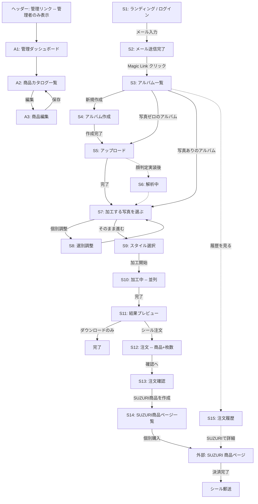

# 画面遷移ドキュメント

最終更新: 2026-05-26 (Admin / 商品カタログ導入)

## 1. 画面一覧

### ユーザー向け

| ID  | 画面名 | ルート | 認証 |
|---|---|---|---|
| S1  | ランディング / ログイン | `/` | 不要 |
| S2  | メール送信完了 | `/auth/check-email` | 不要 |
| S3  | アルバム一覧 | `/albums` | 必要 |
| S4  | アルバム新規作成 | `/albums/new` | 必要 |
| S5  | 画像アップロード | `/albums/[id]/upload` | 必要 |
| S6  | 解析中 (顔判定など) | `/albums/[id]/analyzing` | 必要 |
| S7  | 加工する写真を選ぶ | `/albums/[id]/recommend` | 必要 |
| S8  | 選別調整 (追加/除外) | `/albums/[id]/select` | 必要 |
| S9  | スタイル選択 (個別/一括) | `/albums/[id]/style` | 必要 |
| S10 | 加工中 | `/albums/[id]/transforming` | 必要 |
| S11 | 結果プレビュー / DL | `/albums/[id]/result` | 必要 |
| S12 | 注文 (商品選択+枚数) | `/albums/[id]/order` | 必要 |
| S13 | 注文確認 | `/albums/[id]/order/confirm` | 必要 |
| S14 | SUZURI 商品ページ一覧 | `/albums/[id]/order/done` | 必要 |
| S15 | 注文履歴 | `/orders` | 必要 |
| D1  | デモ (お試し加工) | `/demo` | 不要 |

### 管理者向け

| ID  | 画面名 | ルート | 認証 |
|---|---|---|---|
| A1  | 管理ダッシュボード | `/admin` | 管理者 |
| A2  | 商品カタログ一覧 | `/admin/products` | 管理者 |
| A3  | 商品カタログ編集 | `/admin/products/[id]` | 管理者 |

非管理者がアクセスすると 404 を返す (存在自体を隠す)。

### 法的ページ

| ID  | 画面名 | ルート | 認証 |
|---|---|---|---|
| L1  | 利用規約 | `/legal/terms` | 不要 |
| L2  | プライバシーポリシー | `/legal/privacy` | 不要 |
| L3  | 特定商取引法表記 | `/legal/tokushoho` | 不要 |

## 2. 遷移フロー図



## 3. 主要画面ワイヤーフレーム

### S3: アルバム一覧
```
┌─────────────────────────────────────────────────┐
│ [Logo] アルバム 注文履歴 [管理] user@... [Logout] │
├─────────────────────────────────────────────────┤
│  マイアルバム                  [ + 新規作成 ]   │
│  ┌──────────┐ ┌──────────┐ ┌──────────┐         │
│  │ 京都 春旅 │ │ 北海道    │ │ Hawaii    │         │
│  │ 87枚     │ │ 32枚     │ │ 15枚      │         │
│  └──────────┘ └──────────┘ └──────────┘         │
└─────────────────────────────────────────────────┘
```
※ [管理] は管理者のみ表示

### S9: スタイル選択 (個別+一括)
```
┌─────────────────────────────────────────────────┐
│  ← 京都 春旅                                    │
├─────────────────────────────────────────────────┤
│  [一括適用] アニメ/水彩/油絵/ﾋﾟｸｾﾙ + 追加要望    │
│              [全部に適用]                       │
│                                                 │
│  個別設定                                       │
│  ┌───┐ アニメ ● 水彩 ○ 油絵 ○ ﾋﾟｸｾﾙ ○             │
│  │画像│ [個別の追加要望....................]    │
│  └───┘                                          │
│  ┌───┐ アニメ ○ 水彩 ● 油絵 ○ ﾋﾟｸｾﾙ ○             │
│  │画像│ [個別の追加要望....................]    │
│  └───┘                                          │
│                  [ 加工を開始 → ]               │
└─────────────────────────────────────────────────┘
```

### S12: 注文 (新)
```
┌─────────────────────────────────────────────────┐
│  ← 結果に戻る                                   │
├─────────────────────────────────────────────────┤
│  商品を選ぶ (管理画面で管理)                    │
│  ┌──────────────┐ ┌──────────────┐               │
│  │ ステッカー M │ │ (今後追加)    │               │
│  │ ¥700/枚 (税込)│ │              │               │
│  └──────────────┘ └──────────────┘               │
│                                                 │
│  対象画像と枚数                                 │
│  ┌──┐ ┌──┐ ┌──┐ ┌──┐                            │
│  │画│ │画│ │画│ │画│                            │
│  │− 1 +│  ...                                   │
│  └──┘                                           │
│  合計 4枚 / 商品代金 ¥2,800 (税込)              │
│  ※ 送料は SUZURI 側で別途加算                  │
│                  [ 注文内容を確認 → ]           │
└─────────────────────────────────────────────────┘
```

### S13: 注文確認
```
┌─────────────────────────────────────────────────┐
│  ← 注文に戻る                                   │
├─────────────────────────────────────────────────┤
│  注文確認                                       │
│  数量: 4枚 / 商品代金合計: ¥2,800 (税込)         │
│  ※ 送料は SUZURI 側で別途加算                  │
│                                                 │
│  ☐ 利用規約 / 特商法表記 に同意します           │
│              [ SUZURI で商品を作成 → ]          │
└─────────────────────────────────────────────────┘
```

### S14: SUZURI 商品ページ一覧 (新)
```
┌─────────────────────────────────────────────────┐
│  ← 注文履歴                                    │
├─────────────────────────────────────────────────┤
│  商品の作成が完了しました                       │
│  各カードの「SUZURI で購入」から SUZURI に移動  │
│  ┌──────────┐ ┌──────────┐ ┌──────────┐         │
│  │ 画像     │ │ 画像     │ │ 画像     │         │
│  │ 数量: 1枚 │ │ 数量: 2枚 │ │ 数量: 1枚 │         │
│  │[SUZURIで購入]│ │[SUZURIで購入]│ │[SUZURIで購入]│ │
│  └──────────┘ └──────────┘ └──────────┘         │
└─────────────────────────────────────────────────┘
```

### A2: 商品カタログ一覧
```
┌─────────────────────────────────────────────────┐
│  ← 管理                                         │
├─────────────────────────────────────────────────┤
│  商品カタログ                                   │
│ ┌──────┬─────────┬───────┬───────┬──────┬───┬──┐ │
│ │ 表示名│ SUZURI  │原価税抜│販売税込│マージン│公開│  │ │
│ ├──────┼─────────┼───────┼───────┼──────┼───┼──┤ │
│ │ステッカー│item 11 │ ¥466  │ ¥700  │ ¥170 │ ON│編集│ │
│ │M ホワイト│var 606 │       │       │      │   │  │ │
│ └──────┴─────────┴───────┴───────┴──────┴───┴──┘ │
└─────────────────────────────────────────────────┘
```

### A3: 商品カタログ編集
```
┌─────────────────────────────────────────────────┐
│  ← 商品カタログ                                 │
├─────────────────────────────────────────────────┤
│  基本情報                                       │
│  表示名: [ステッカー (M / ホワイト)        ]    │
│  並び順: [1     ]                               │
│  SUZURI item ID: 11 / variant ID: 606           │
│  ☑ 注文画面に表示する (公開)                    │
│                                                 │
│  価格                                           │
│  ┌──────────┐ ┌────────────┐ ┌──────────────┐    │
│  │原価(税抜)│ │販売(税込)   │ │SUZURI渡しマージン│ │
│  │ ¥466    │ │ ¥700       │ │ ¥170         │ │
│  │SUZURI固定│ │(入力)       │ │自動計算       │ │
│  └──────────┘ └────────────┘ └──────────────┘    │
│                              [ 保存 ]           │
└─────────────────────────────────────────────────┘
```

## 4. 共通コンポーネント

- **ヘッダー**: Logo / アルバム / 注文履歴 / **管理 (管理者のみ)** / ユーザーメニュー / ログアウト
- **フッター**: 利用規約 / プライバシー / 特商法
- **管理ゲート**: `/admin/*` は `admin_users` テーブルに登録された user_id のみアクセス可。それ以外は notFound()

## 5. データの流れ (注文〜SUZURI連携)

```
[S12 注文] -- createOrderAction
   ↓ 商品カタログから sell_price を取得し total_jpy 計算
   ↓ print_orders を user_id 紐付けで作成
   ↓ print_order_items に edit_id + product_catalog_id を保存

[S13 注文確認] -- handoffToSuzuriAction
   ↓ listOrderItemsForFulfillment (catalog 結合)
   ↓ 各 edit の result_storage_path を base64 data URI 化
   ↓ calcSuzuriMargin(sell_price, base_price) でトリブン算出
   ↓ SuzuriPrintProvider.createOrder()
      └→ POST /api/v1/materials × N (per item)
         body: { texture, title, price: margin, products: [...] }

[S14 商品ページ一覧]
   ↓ saveOrderItemProductUrl で URL を保存
   ↓ markOrderCreated で order.status = 'created'
```
